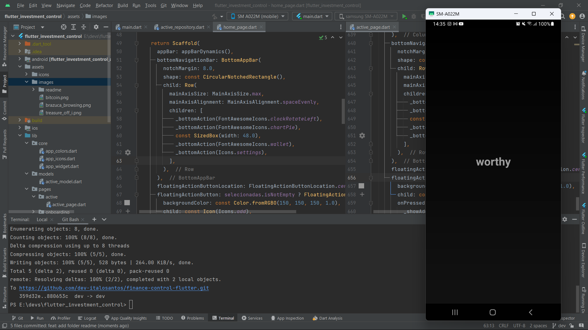
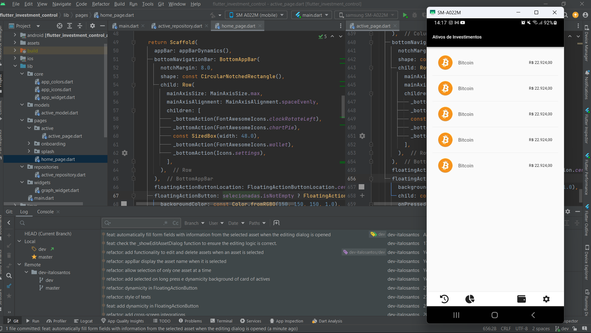
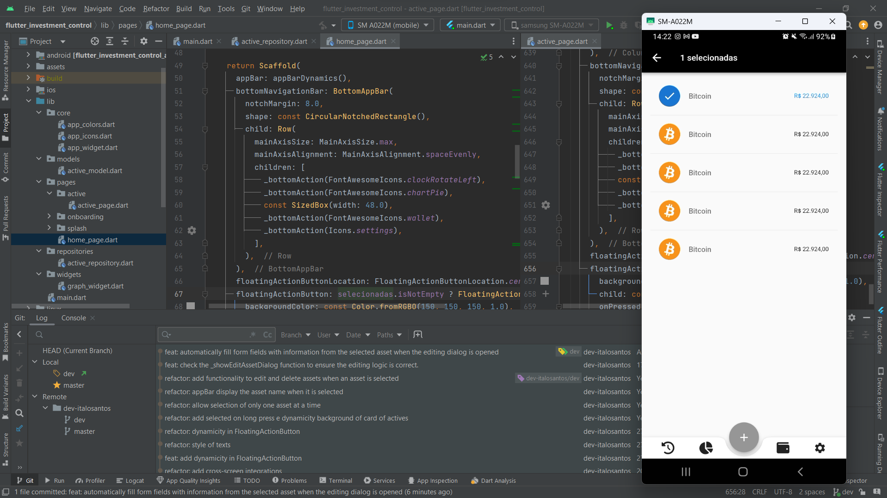
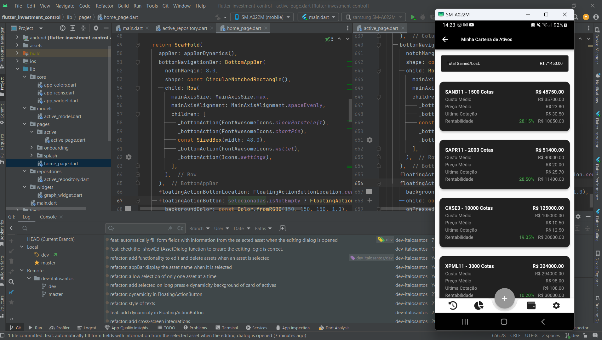
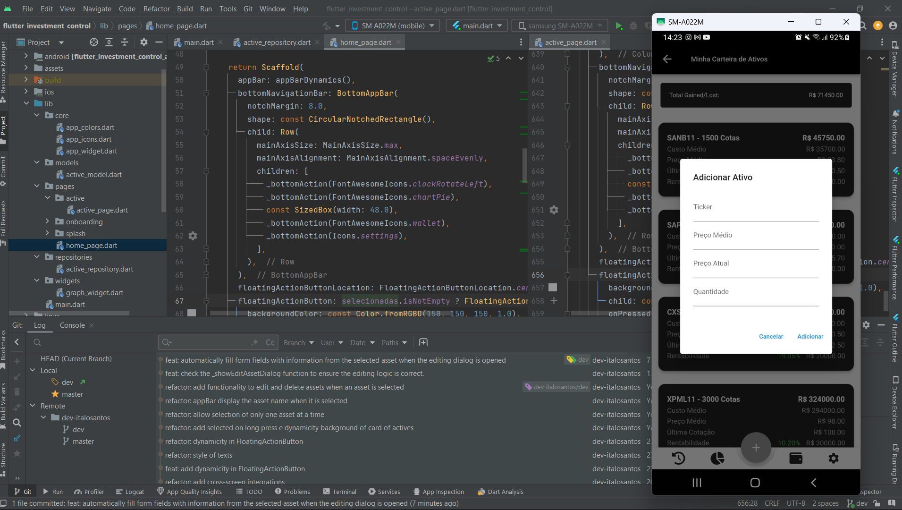
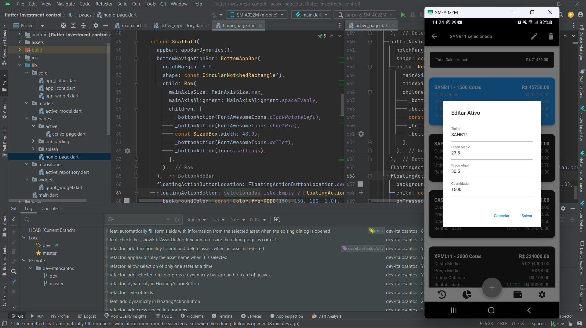

<h4 align="center">
    
     
     
    Project worthy - Manage all your investments in one place.
</h4>

## Project's goal

The Objective of the Consolidated Investment Management Project

The contemporary financial world is characterized by the diversity of investment options available,
from stocks and bonds to cryptocurrencies and mutual funds. In this complex scenario, there is a need
for an innovative project that aims to simplify and optimize the investment management process,
offering investors a comprehensive tool: "Manage all your investments in one place."

The main objective of this project is to provide investors with a unified solution for monitoring and managing their financial assets.
Amid a diverse range of investment platforms and instruments, the centralization of this information aims to facilitate decision-making,
improve transparency and, consequently, enhance users' financial results.

Advantages of Consolidated Management:

Overall view:
By consolidating all investments onto a single platform, users will have a comprehensive view of their assets,
enabling a clearer understanding of asset allocation and overall portfolio performance.

Ease of Access:
Centralizing investment management offers convenient access from any device connected to the internet.
This means investors can monitor and adjust their strategies anytime, anywhere.

Performance Analysis:
The tool will provide advanced performance analysis capabilities, allowing users to evaluate return on investment,
identify patterns and make informed decisions based on solid data.

Risk management:
The project aims to integrate efficient risk management tools, providing personalized alerts and insights into the volatility of different assets,
helping investors mitigate potential losses.

Innovation and Technology:

To achieve these goals, the project will rely on advanced technologies such as artificial intelligence
and machine learning to offer personalized recommendations, predictive analytics and an intuitive user experience.

Conclusion:

In summary, the "Manage all your investments in one place" project aims to simplify investors' financial lives,
providing a unique and comprehensive tool for monitoring their assets. By offering transparency,
accessibility and advanced analytics, it seeks to empower investors to make more informed decisions and achieve their financial goals efficiently.

## :computer: Pagina Web

      
    
    
    
    ,
    
    

<h6 align="center">Sorry it's still in development</h6>